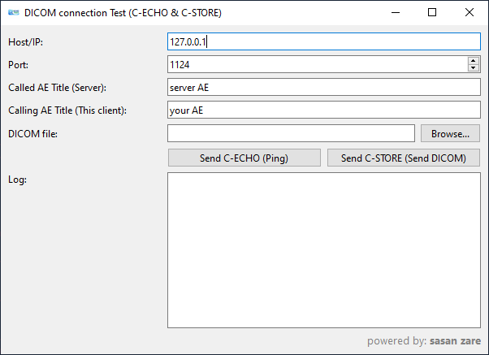

# DICOM Test Sender (C-ECHO & C-STORE)

<p align="center">
  
</p>

A simple **PyQt6 GUI tool** for testing DICOM connections.

---

## Features
- Send DICOM **C-ECHO** (Ping)
- Send DICOM **C-STORE**
- Custom AE Titles
- Multiple storage presentation contexts
- Simple and clean PyQt6 GUI

---

## Requirements
- Python 3.9+
- PyQt6
- pydicom
- pynetdicom

---

## Installation

```bash
pip install -r requirements.txt
```

-------------------------------------------------------------------------------
-------------------------------------------------------------------------------

The birth of this application comes with a story—and in the following section, I’ll be sharing that story with you.

# Story
Like many of my previous projects, this software was born out of a real problem I faced in my daily work. I work in after‑sales service for X‑ray imaging devices, which means I often deal with medical images and sometimes need to remotely connect to client computers to troubleshoot issues with PACS or printers.

One day, I encountered a situation where the medical center refused to provide clear PACS connection details (such as AE Title and Port). They insisted the problem was on our side, and unfortunately even my manager echoed that claim. The network status was unclear—basic tools like ping or ARP could not reliably confirm whether the PACS server was reachable.

That day, I used PowerShell with a C‑Echo command to demonstrate to the center’s IT staff that the issue was indeed with the server connection, since no response was received with the given parameters. Eventually, with their cooperation, the problem was resolved and communication between our software and the PACS server was restored.

Later that evening, while reading about PACS and printer communication, I stumbled upon documentation about the DICOM standards for C‑Echo and C‑Store. I realized that although these protocols are fundamental, I couldn’t find any lightweight tool that could test both at the same time.

So I decided to build one myself—a small, fast, portable application that could be easily shared via Dropbox or Google Drive, and capable of testing both protocols whenever needed. This project was the result, and I wanted to share it on GitHub so that others facing similar challenges could benefit from it too.